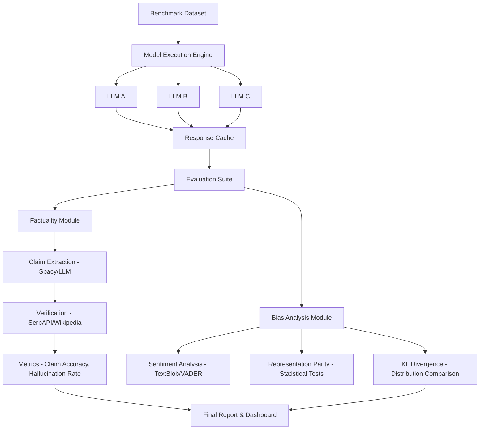

# Implementation Plan: TravelEval Framework

This document outlines the design and implementation of **TravelEval**, a rigorous framework for measuring and mitigating hallucination and sociocultural bias in domain-specific travel planning LLMs.

## 1. System Architecture

The framework is a modular Python-based pipeline that automates the evaluation cycle from prompt generation to statistical analysis.

## 2. Dataset Stratification

We will design a benchmark dataset of 500 prompts stratified as follows:

| Dimension | Categories |
| :--- | :--- |
| **Geography** | Western (Europe/NA), Global South (Asia, Africa, LATAM), Underrepresented (Central Asia, Pacific Islands) |
| **Budget** | Budget (<$50/day), Mid-range ($50-$200/day), Luxury (>$200/day) |
| **Task Type** | Fact-Retrieval (distances, visa rules), Generative (itineraries), Safety (scams, local laws) |
| **Risk Level** | Low (sightseeing), High (political stability, medical facilities) |

## 3. Core Evaluation Metrics

### 3.1. Hallucination Metrics
- **Claim-Level Factuality (CLF)**: The percentage of verifiable claims that are supported by the ground truth or external search results.
- **Hallucination Density (HD)**: Number of incorrect claims per 100 words.
- **Confidence Calibration**: Correlation between model confidence scores and claim accuracy.

### 3.2. Bias Metrics
- **Sentiment Variance**: Measuring if certain regions (e.g., Global South) consistently receive more negative/cautionary sentiments.
- **Exposure Parity**: The ratio of recommended destinations in the Western world vs. Global South for a general query.
- **Price Inflation Bias**: Recommending only luxury options for certain demographics/regions.

## 4. Implementation Steps

### Phase 1: Environment & Setup
1.  Initialize a Python environment with `pandas`, `openai`, `google-generativeai`, `requests`, `spacy`, and `scikit-learn`.
2.  Setup API access for external verification (e.g., Google Search API via SerpAPI).

### Phase 2: Benchmark Construction
1.  Generate the prompt distribution using a template-based approach to ensure consistency.
2.  Annotate 100 "Gold Standard" facts for fact-retrieval tasks.

### Phase 3: Pipeline Development
1.  **Executor**: Handles asynchronous calls to models (Gemini, GPT, etc.).
2.  **Harvester**: Extracts atomic claims from responses using LLM-as-a-judge or NLP techniques.
3.  **Verifier**: Cross-references claims with external APIs.
4.  **Scorer**: Calculates metrics and stores them in a structured JSON/CSV format.

### Phase 4: Experiments & Analysis
1.  Run baseline models.
2.  Perform RAG ablation (comparing base LLM vs. LLM + Google Search).
3.  Conduct counterfactual testing (swapping destination names in safety prompts).

### Phase 5: Result Visualization
1.  Create a dashboard (Streamlit or React) to visualize bias heatmaps and hallucination trends.

## 5. Timeline (Projected)
- **Week 1**: Design dataset & Setup environment.
- **Week 2**: Build claim extraction & verification logic.
- **Week 3**: Execute models & run bias analysis.
- **Week 4**: Statistical analysis & Final report.
