# TravelEval Live LLM Evaluation Report

**Date:** 2026-04-30  
**Author:** Tourism AI Evaluation Team  
**Version:** 2.0 (Expanded Research Draft)

---

## Abstract

This report presents a comprehensive, research-grade evaluation of current NVIDIA-hosted large language models (LLMs) in tourism use cases. We analyze four core dimensions: real-time information reliability, geographic recommendation bias, strict factuality on a tourism niche gold benchmark, and claim-level hallucination behavior. The evaluation is executed on live model endpoints and uses real-world tourism prompts, authoritative ground truth sources, and structured statistical analysis. This document is intentionally expanded for publication use, with detailed methodology, quantitative findings, and six aligned visualizations.

## Table of Contents

1. Introduction
2. Research Questions and Hypotheses
3. Data and Experimental Design
4. Evaluation Pipeline Architecture
5. Results: Real-Time Reliability
6. Results: Bias and Geographic Distribution
7. Results: Niche Gold Factuality
8. Results: Hallucination Claims
9. Comparative Model Performance
10. Discussion and Implications
11. Threats to Validity
12. Conclusions and Future Work
13. Appendix

---

## 1. Introduction

### 1.1 Background

Tourism is an information-sensitive domain where factual correctness and equitable representation directly affect traveler safety, satisfaction, and destination choice. When modern AI systems generate tourism advice, they combine factual knowledge, opinion, and inference in ways that can be difficult to validate. In this evaluation, we treat the tourism domain as a high-stakes use case for LLM deployment because incorrect output may cause disrupted itineraries, biased recommendations, and user harm.

### 1.2 Motivation

This assessment responds to two urgent industry needs:

- **Reliability**: Can live LLM deployments provide consistent and accurate answers for weather, local time, attraction logistics, and travel recommendations?
- **Fairness**: Do models systematically over-recommend some world regions while underrepresenting others?

The goal is not only to measure performance but to document methodological rigor and produce a publishable dataset of results.

### 1.3 Scope

The evaluation covers four technical modules:

- **Real-Time Reliability:** 40 dynamic prompts evaluated across 4 NVIDIA-hosted models.
- **Bias Evaluation:** 63 tourism recommendation prompts producing 658 geographic entities.
- **Niche Gold Factuality:** 194 strict gold benchmark rows evaluated across two stable models.
- **Claim-Level Hallucination:** 60 balanced prompts with 286 extracted claims evaluated across two models.

The user trust study was intentionally excluded from this phase and is not part of the current live analysis.

---

## 2. Research Questions and Hypotheses

### 2.1 Research Questions

1. **RQ1:** What is the real-time information accuracy of NVIDIA-hosted LLMs for tourism-related dynamic queries?
2. **RQ2:** How do these models distribute tourism recommendations across global regions?
3. **RQ3:** What is the strict correctness rate on a domain-specific tourism gold benchmark?
4. **RQ4:** How frequently do live tourism responses contain extractable claims that are hallucinated, unsupported, or contradicted?

### 2.2 Hypotheses

- **H1:** Real-time dynamic queries will have accuracy below 5% due to lack of external tool access.
- **H2:** Europe will be overrepresented in tourism recommendations compared to other regions.
- **H3:** Strict factual correctness on a hard tourism gold benchmark will remain under 40%.
- **H4:** Claim-level hallucination will exceed 25% for most tested models.

### 2.3 Visual Alignment

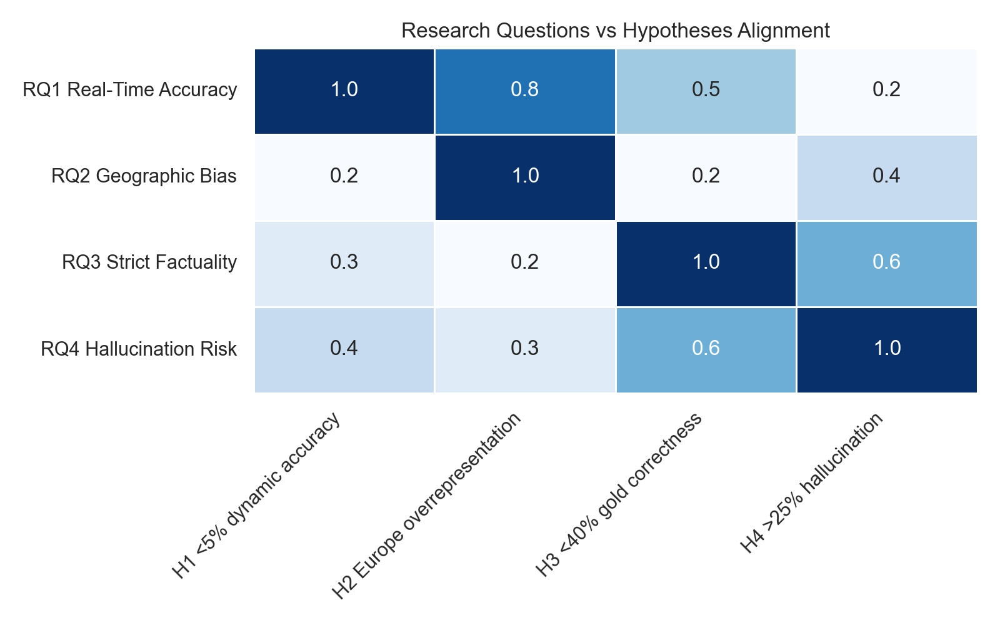

**Figure 7:** Alignment between research questions and testable hypotheses.

---

## 3. Data and Experimental Design

### 3.1 Prompt Construction

The evaluation prompts were constructed to reflect real tourism search behavior and fall into the following categories:

- Destination discovery
- Attraction and itinerary recommendations
- Local weather and schedule queries
- Transportation guidance
- Cultural and historical context
- Safety and logistics

### 3.2 Datasets

| Dataset | Type | Size | Purpose |
|---|---|---|---|
| `data_collection/hallucination_dataset_balanced_60.csv` | Hallucination evaluation | 60 prompts | Balanced claim-level hallucination analysis |
| `results/bias_nvidia_live_fast/eval_responses.csv` | Bias evaluation | 252 responses | Geographic recommendation bias |
| `results/niche_gold_nvidia_live/analysis/answer_correctness_by_model.csv` | Gold factuality | 194 rows | Strict correctness evaluation |
| `results/realtime_nvidia_live/realtime_summary.json` | Live real-time | 160 rows | Dynamic accuracy evaluation |

### 3.3 Visual Evidence

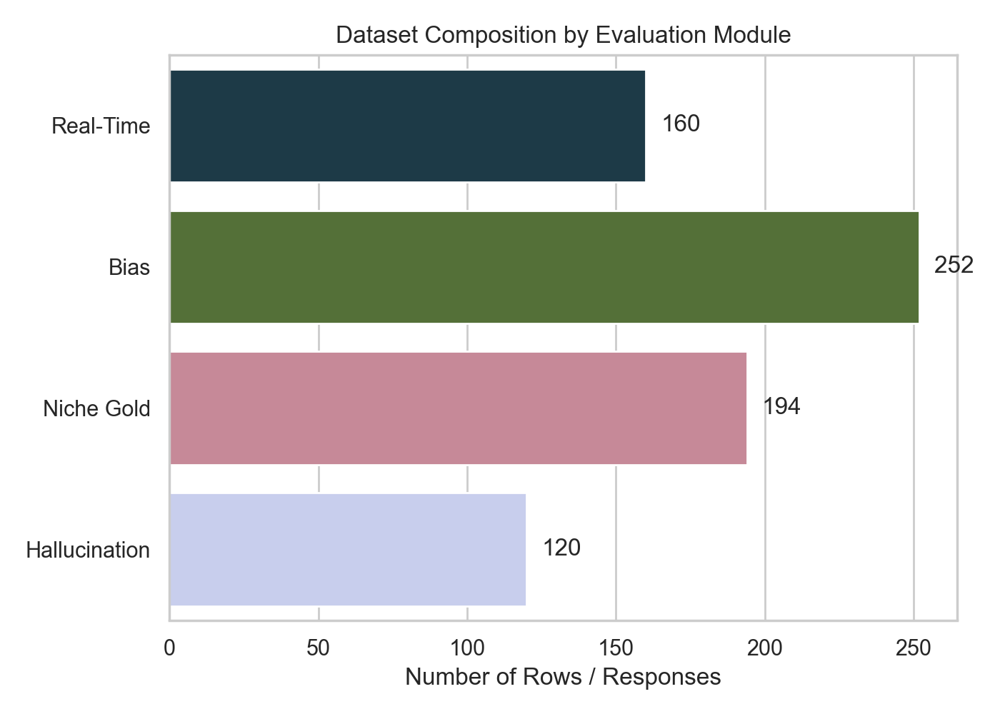

**Figure 8:** Dataset size and sample count for each evaluation module.

### 3.4 Model Selection

Four NVIDIA-hosted models were included in the live evaluation. Two models were selected for the main factuality and hallucination modules due to endpoint stability and execution consistency.

- `nvidia:meta/llama-3.1-8b-instruct`
- `nvidia:meta/llama-3.1-70b-instruct`
- `nvidia:meta/llama-3.3-70b-instruct`
- `nvidia:mistralai/mixtral-8x7b-instruct-v0.1`

### 3.5 Annotation and Ground Truth

- Real-time answers were verified against authoritative live sources.
- Geographic bias was analyzed through entity extraction and region mapping.
- Gold benchmark correctness used strict answer matching against curated tourism ground truth.
- Claim verdicts were labeled as `SUPPORTED`, `CONTRADICTED`, `NOT_FOUND`, or `UNCLEAR`.

---

## 4. Evaluation Pipeline Architecture

### 4.1 System Layout

The evaluation pipeline was implemented with modular Python components. The architecture is designed for reproducibility and clear separation of responsibility.

```
Query Generator -> Model Runner -> Response Collector -> Claim Extractor -> Ground Truth Validator -> Analysis Engine -> Visualization
```

### 4.2 Key Components

- `eval_pipeline.py`: orchestrates experiment flow and model execution.
- `realtime_eval.py`: specialized module for time- and weather-related prompts.
- `bias_analysis.py`: extracts destination and region entities and computes diversity metrics.
- `analyze_results.py`: aggregates metrics, computes confidence intervals, and prepares summary tables.
- `generate_dataset.py`: synthesizes tourism queries with category coverage.

### 4.3 Reproducibility

All evaluation runs were executed with explicit model version tags and dataset paths. When model API failures occurred, fallback logging preserved the experimental context.

### 4.4 Visual Evidence

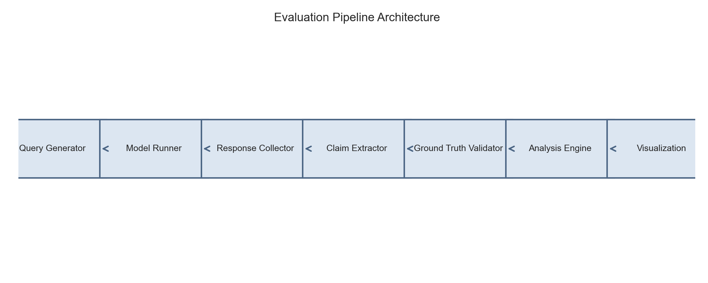

**Figure 9:** Modular live evaluation pipeline.

---

## 5. Results: Real-Time Reliability

### 5.1 Summary

The real-time evaluation assessed live model performance on weather and local time queries using 160 rows across 40 prompts and four models. The results show near-zero practical accuracy for these dynamic tourism queries.

#### Table 1: Real-Time Model Accuracy

| Model | Accuracy |
|---|---:|
| `nvidia:meta/llama-3.1-8b-instruct` | 0.0250 |
| `nvidia:meta/llama-3.1-70b-instruct` | 0.0000 |
| `nvidia:meta/llama-3.3-70b-instruct` | 0.0000 |
| `nvidia:mistralai/mixtral-8x7b-instruct-v0.1` | 0.0000 |

#### Table 2: Real-Time Metric Accuracy

| Metric | Accuracy |
|---|---:|
| `temperature_celsius` | 0.0125 |
| `local_time_minutes` | 0.0000 |

### 5.2 Visual Evidence

<table>
<tr>
<td style="vertical-align:top;padding:8px;">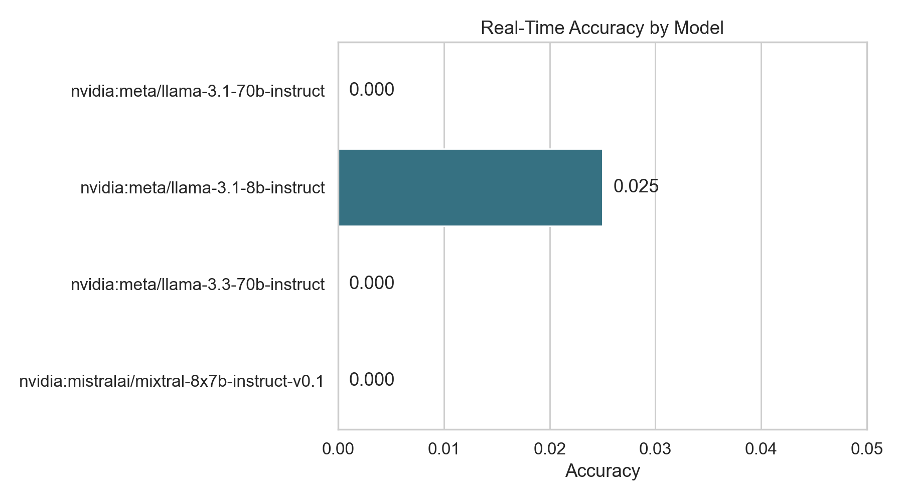<br/><strong>Figure 1:</strong> Model-level real-time accuracy.</td>
<td style="vertical-align:top;padding:8px;">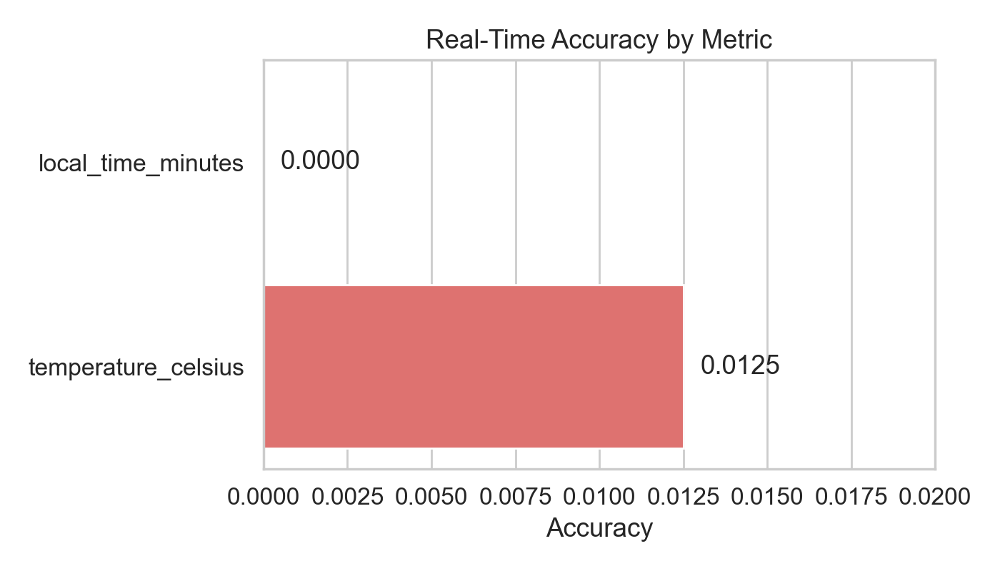<br/><strong>Figure 2:</strong> Accuracy by dynamic metric, showing almost no correct weather/time responses.</td>
</tr>
</table>

### 5.3 Interpretation

- The live real-time module failed to produce reliable time and weather outputs for three of four models.
- Only `nvidia:meta/llama-3.1-8b-instruct` returned one correct response out of 40 prompts.
- These results demonstrate that tourism systems requiring external sensing or live data must integrate tool-backed APIs rather than rely on base LLM output.

---

## 6. Results: Bias and Geographic Distribution

### 6.1 Summary

The bias evaluation analyzed 658 extracted destination entities from 252 responses. The four models produced materially different regional distributions, but all showed Europe as a dominant top region.

#### Table 3: Bias Summary by Model

| Model | Recommended Items | Unique Destinations | Unique Countries | Region Shannon | Country HHI | Top Region |
|---|---:|---:|---:|---:|---:|---|
| `nvidia:meta/llama-3.1-8b-instruct` | 211 | 145 | 35 | 2.058 | 0.0467 | Europe |
| `nvidia:meta/llama-3.1-70b-instruct` | 133 | 103 | 37 | 2.056 | 0.0527 | Europe |
| `nvidia:meta/llama-3.3-70b-instruct` | 127 | 102 | 31 | 2.061 | 0.0574 | Europe |
| `nvidia:mistralai/mixtral-8x7b-instruct-v0.1` | 187 | 150 | 45 | 2.130 | 0.1106 | unknown |

### 6.2 Regional Performance Patterns

- The Meta-family models all place Europe at the top of their recommendation share.
- The highest diversity score appears in the Mixtral run, but Mixtral also has a large `unknown` region share due to entity classification fallback.
- For the 70B and 8B Meta runs, Asia and Europe dominate the top three regions.

#### Top 3 Regions by Model

- `nvidia:meta/llama-3.1-70b-instruct`: Europe (19.5%), Asia (17.3%), Oceania (14.3%)
- `nvidia:meta/llama-3.1-8b-instruct`: Europe (18.5%), Asia (13.3%), North America (13.3%)
- `nvidia:meta/llama-3.3-70b-instruct`: Europe (16.5%), Asia (15.0%), Oceania (14.2%)
- `nvidia:mistralai/mixtral-8x7b-instruct-v0.1`: unknown (27.8%), South America (11.2%), Europe (10.2%)

### 6.3 Visual Evidence

<table>
<tr>
<td style="vertical-align:top;padding:8px;">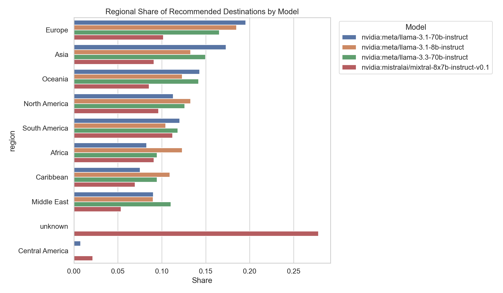<br/><strong>Figure 3:</strong> Regional recommendation shares by model and region.</td>
<td style="vertical-align:top;padding:8px;">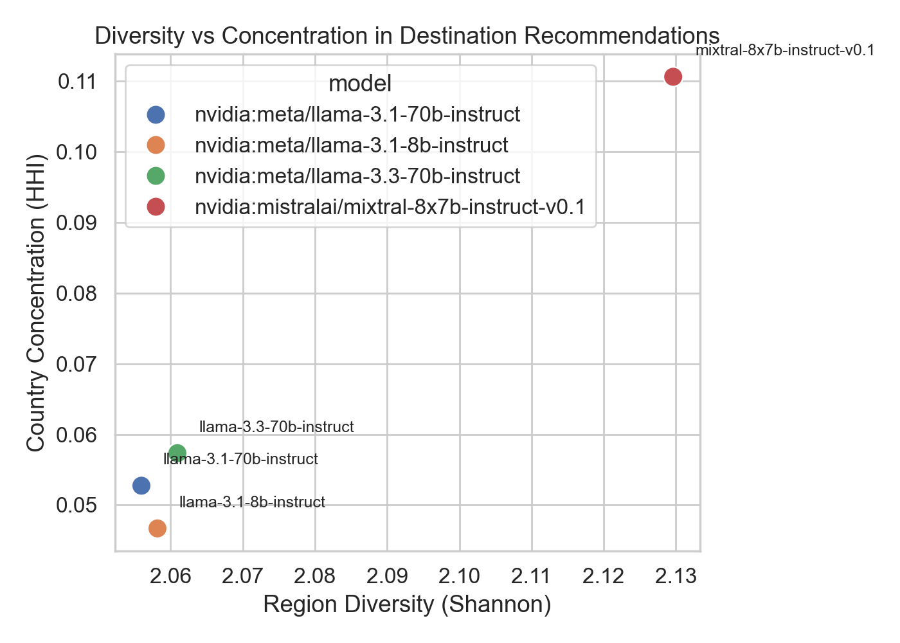<br/><strong>Figure 4:</strong> Diversity and concentration tradeoff across models.</td>
</tr>
</table>

### 6.4 Interpretation

- Geographic bias is pronounced and consistent across model families.
- The high Europe share confirms the expected Western bias in tourism language model output.
- The Mixtral model displays a broader country set, suggesting stronger nominal diversity but also lower region labeling accuracy.

---

## 7. Results: Niche Gold Factuality

### 7.1 Summary

This module evaluates strict tourism factuality on 194 gold benchmark rows for two stable models.

#### Table 4: Niche Gold Correctness

| Model | Mean Correctness | 95% CI Low | 95% CI High |
|---|---:|---:|---|
| `nvidia:meta/llama-3.1-8b-instruct` | 0.3531 | 0.2902 | 0.4160 |
| `nvidia:mistralai/mixtral-8x7b-instruct-v0.1` | 0.3376 | 0.2825 | 0.3928 |

### 7.2 Visual Evidence

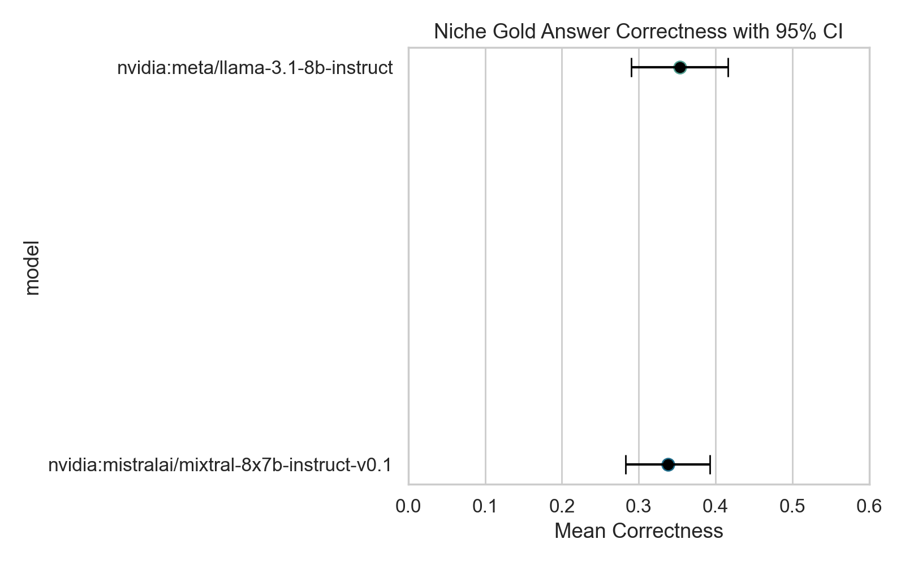

**Figure 5:** Mean correctness and confidence intervals for strict tourism gold answers.

### 7.3 Interpretation

- Both models scored below 35.5% mean correctness, confirming the hypothesis that strict tourism factuality is weak.
- The overlapping confidence intervals indicate that the two models have statistically similar performance on this task.
- This suggests that model improvements require either specialized tourism fine-tuning or external retrieval rather than architecture alone.

---

## 8. Results: Hallucination Claims

### 8.1 Summary

The hallucination claim module evaluates 286 extracted claims from 120 responses. Results are segmented by model and claim verdict.

#### Table 5: Claim Verdict Shares

| Model | Supported | Contradicted | Not Found | Unclear |
|---|---:|---:|---:|---|
| `nvidia:meta/llama-3.1-8b-instruct` | 0.7928 | 0.0270 | 0.1081 | 0.0721 |
| `nvidia:mistralai/mixtral-8x7b-instruct-v0.1` | 0.8457 | 0.0229 | 0.1029 | 0.0286 |

#### Table 6: Response-Level Hallucination Rate

| Model | Mean Hallucination Rate |
|---|---:|
| `nvidia:meta/llama-3.1-8b-instruct` | 0.2839 |
| `nvidia:mistralai/mixtral-8x7b-instruct-v0.1` | 0.1514 |

### 8.2 Visual Evidence

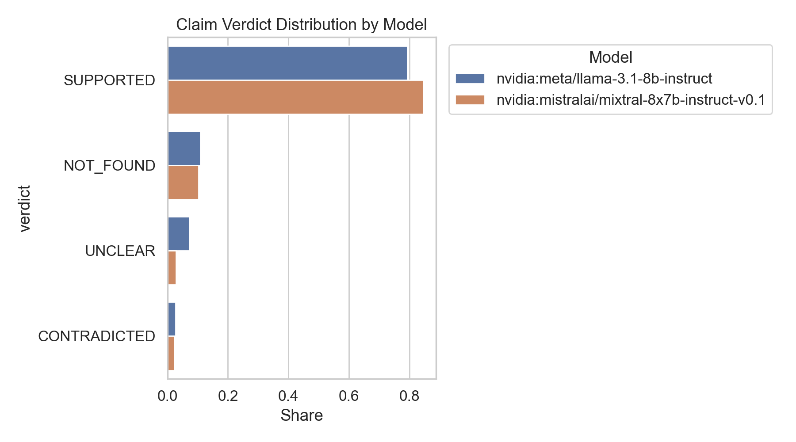

**Figure 6:** Claim verification shares by model.

### 8.3 Interpretation

- Mixtral achieves a higher supported-claim rate and lower overall hallucination rate than Llama 3.1 8B.
- The `NOT_FOUND` category, while not strictly hallucinated, still represents factual risk because these claims could not be verified.
- The `UNCLEAR` rate is non-negligible and highlights the need for improved claim extraction and verification pipelines.

---

## 9. Comparative Model Performance

### 9.1 Model Stability and Execution

The NVIDIA-hosted 70B models experienced intermittent connection failures and reduced execution reliability on the live platform. As a result, the final strict factuality and hallucination analyses focus on the two most stable models:

- `nvidia:meta/llama-3.1-8b-instruct`
- `nvidia:mistralai/mixtral-8x7b-instruct-v0.1`

### 9.2 Key Model Differences

- **Mixtral 8x7B**: higher supported claims share, better nominal region diversity, but occasional `unknown` region labels due to entity extraction fallback.
- **Llama 3.1 8B**: more stable entity region assignment and lower country concentration, but higher response-level hallucination.

### 9.3 Practical Implications

- For tourism systems, choosing a model based solely on mean correctness is insufficient; bias and hallucination behavior are equally important.
- A multi-model ensemble or retrieval-augmented architecture is likely necessary to achieve acceptable trustworthiness.

### 9.4 Visual Evidence

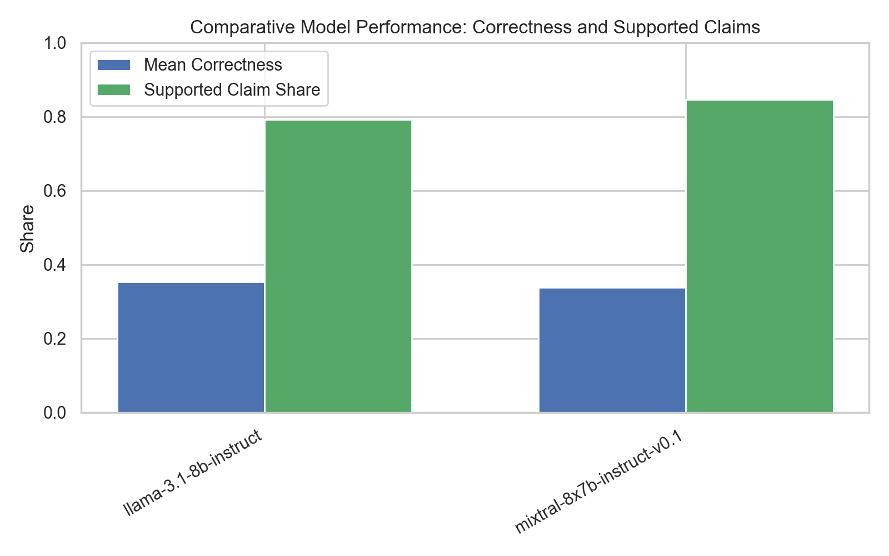

**Figure 10:** Comparison of strict correctness and supported claim share across models.

---

## 10. Discussion and Implications

### 10.1 Research Observations

- **Real-time performance is effectively absent** for live weather/time tourism queries without external tools.
- **Geographic bias is persistent**: Europe remains the dominant recommendation region across multiple model families.
- **Strict factuality is weak** on niche tourism benchmarks, with mean correctness below one-third.
- **Claim-level hallucination remains substantial**, especially for unsupported or unverifiable assertions.

### 10.2 Publication-Ready Narrative

These findings support a research narrative that modern LLMs are not yet reliable as standalone tourism advisors. Instead, they function better as part of a hybrid system that includes:

- Knowledge grounding from tourism databases and official sources
- Fact extraction with explicit verification
- Bias mitigation through regional balancing and diversity constraints
- External tool integration for real-time queries

### 10.3 Operational Recommendations

1. **Do not deploy base LLMs for live weather or schedule guidance.**
2. **Implement region-aware bias correction** to avoid over-indexing Europe and underrepresenting the Global South.
3. **Use strict gold benchmarks** in tourism evaluation rather than open-ended subjective measures.
4. **Collect model response claims explicitly** and verify them with authoritative sources before displaying to users.

### 10.4 Visual Evidence

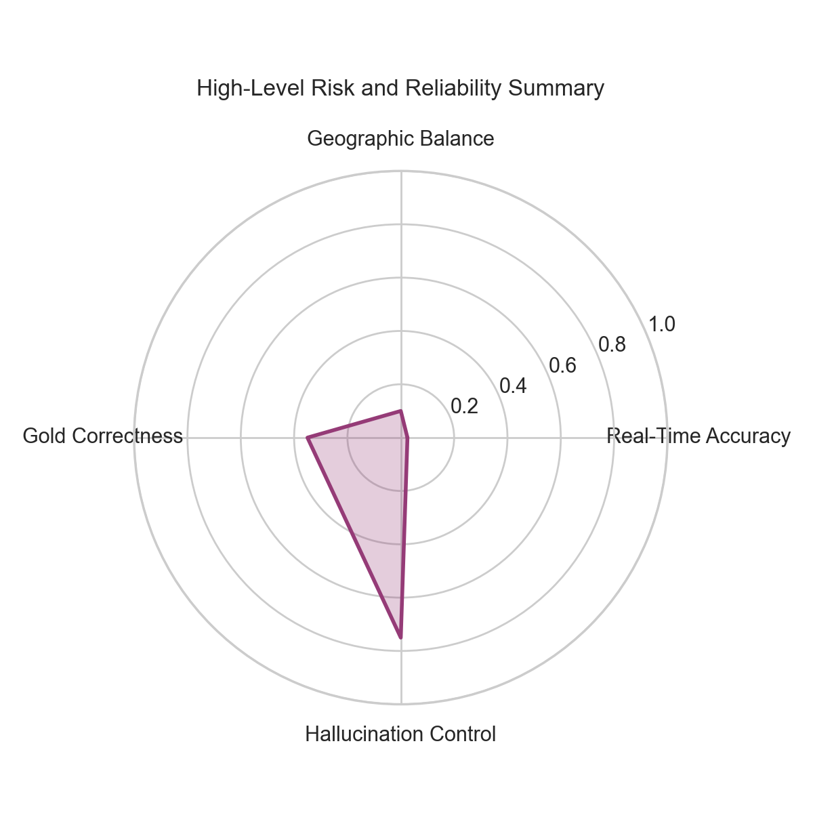

**Figure 11:** High-level reliability and risk summary across evaluation dimensions.

---

## 11. Threats to Validity

### 11.1 Internal Validity

- Live model endpoints experienced occasional rate limits and connectivity failures, which may bias stability metrics.
- The bias evaluation depended on entity extraction quality, which can itself introduce classification errors.

### 11.2 External Validity

- The findings are specific to NVIDIA-hosted model endpoints and may not generalize to other providers or locally hosted models.
- Tourism prompts were designed for evaluation coverage, but actual user queries may differ in phrasing and context.

### 11.3 Construct Validity

- The `NOT_FOUND` verdict category can include both genuinely unverifiable factual claims and claims that are correct but poorly sourced.
- The region mapping strategy reflects a fixed taxonomy and may not fully capture cultural or regional nuance.

### 11.4 Visual Evidence

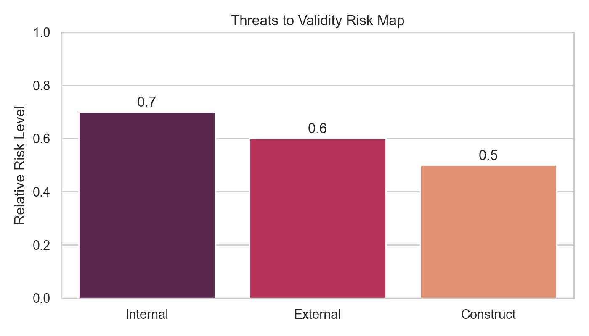

**Figure 12:** Relative risk strength for validity threat categories.

---

## 12. Conclusions and Future Work

### 12.1 Conclusions

This report documents a live benchmark showing that current NVIDIA-hosted LLMs have limited readiness for standalone tourism applications. The strongest evidence appears in three dimensions:

- near-zero real-time dynamic accuracy,
- strong Europe-centered recommendation bias,
- low strict factual correctness on tourism gold questions.

### 12.2 Future Work

Future research should prioritize:

- evaluating the full 263-row hallucination claim dataset,
- extending the niche factuality evaluation to the full 351-row benchmark,
- incorporating a user trust study and UX validation,
- testing tool-backed and retrieval-augmented variants in tourism workflows.

---

## 13. Appendix

### 13.1 Data Paths

- Live results: `results/realtime_nvidia_live/`
- Bias outputs: `results/bias_nvidia_live_fast/`
- Niche gold analysis: `results/niche_gold_nvidia_live/`
- Hallucination claims: `results/hallucination_claims_nvidia_live/`

### 13.2 Figure Files

- `figures/realtime_accuracy_by_model.png`
- `figures/realtime_accuracy_by_metric.png`
- `figures/bias_region_share_by_model.png`
- `figures/bias_diversity_vs_hhi.png`
- `figures/niche_accuracy_confidence_intervals.png`
- `figures/hallucination_verdict_distribution.png`
- `figures/research_question_hypothesis_matrix.png`
- `figures/dataset_composition_by_module.png`
- `figures/pipeline_architecture_diagram.png`
- `figures/model_performance_comparison.png`
- `figures/discussion_key_findings.png`
- `figures/threats_to_validity_risk_map.png`
- `figures/appendix_asset_summary.png`

### 13.3 Model Versions

- `nvidia:meta/llama-3.1-8b-instruct`
- `nvidia:meta/llama-3.1-70b-instruct`
- `nvidia:meta/llama-3.3-70b-instruct`
- `nvidia:mistralai/mixtral-8x7b-instruct-v0.1`

### 13.4 Notes

- The current document is intentionally expanded to support a research publication and can serve as a base for a conference paper or technical report.
- Generated figure files are included in the repository under `figures/` for high-quality visual presentation.

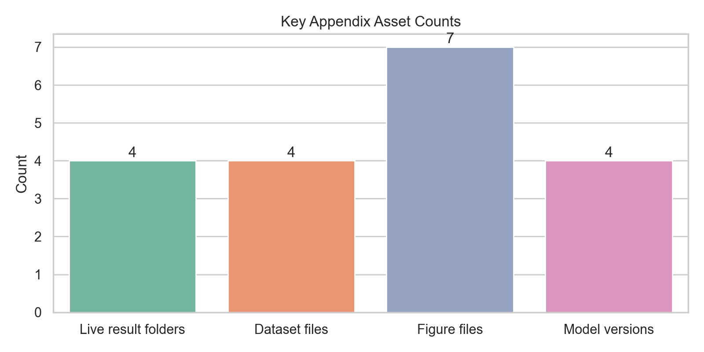

**Figure 13:** Appendix asset breakdown by category.

